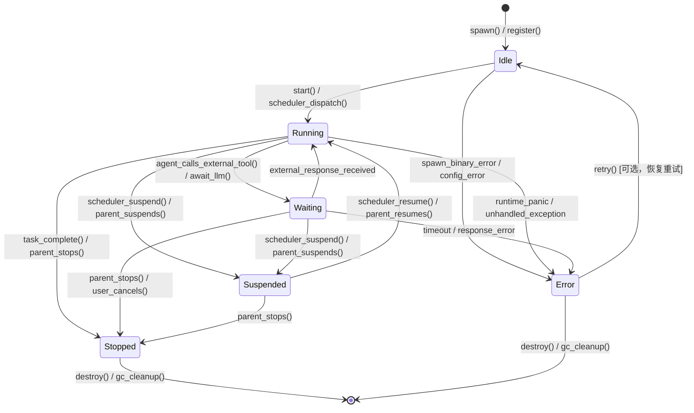

# Multi-Agent 生命周期状态机设计方案

> 状态：已定稿 | 作者：脑暴虾 | 日期：2026-03-25

---

## 文档变更记录

| 日期 | 修改者 | 修改内容 |
|------|--------|----------|
| 2026-03-25 | Braino | 初次撰写。细化 docs/agent/README.md 和 docs/agent/MULTI_AGENT_ARCHITECTURE.md 第 8 节中标记为 TODO 的状态转换触发条件、资源清理和父子生命周期关联。 |

---

## 1. 背景与问题

### 1.1 现状

`src/agent/mod.rs` 中定义了 6 个 `AgentState`：

```rust
pub enum AgentState {
    Idle,       // Created, not started
    Running,    // Actively processing
    Waiting,    // Waiting for response
    Suspended,  // Paused by scheduler
    Stopped,    // Completed or killed
    Error,      // Crashed with error
}
```

`src/agent/registry.rs` 中 `is_valid_transition()` 函数定义了当前合法的状态转换：

```
Idle    → Running, Error
Running → Waiting, Suspended, Stopped, Error
Waiting → Running, Suspended, Stopped, Error
Suspended → Running, Stopped
Stopped  → (terminal)
Error    → (terminal)
```

### 1.2 待解决的问题

| 问题 | 现状 | 需要的细化 |
|------|------|-----------|
| **状态转换触发条件不明确** | `is_valid_transition()` 只判断"能不能转"，没有记录"谁触发了什么导致转换" | 明确每条转换的触发源（用户/父 Agent/调度器/自身错误） |
| **资源清理规范缺失** | 状态转换时哪些资源该清理、哪些该保留，完全没有定义 | 制定每个转换节点的清理动作（进程/内存/文件句柄/子 Agent） |
| **父子生命周期未关联** | `get_children()` 等查询方法存在，但父停止时子是否级联停止、子被清理时父是否感知，均未定义 | 定义级联停止/恢复/销毁规则 |
| **Suspended vs 主动暂停混淆** | `Suspended` 注释写"Paused by scheduler"，但没有区分是调度器暂停还是 Agent 主动要求暂停 | 区分 `Suspended(Spontaneous)` vs `Suspended(Forced)` |

---

## 2. 完整状态转换图

### 2.1 状态定义

| 状态 | 含义 | 进程 | 子 Agent | 内存数据 |
|------|------|------|----------|----------|
| **Idle** | 已创建，等待调度 | 未启动 | 保持原状态 | 完整保留 |
| **Running** | 正在执行任务 | 启动中/运行中 | 可创建新子 | 完整保留 |
| **Waiting** | 等待外部响应（LLM/用户/工具） | 运行中，阻塞在 IO | 保持原状态 | 完整保留 |
| **Suspended** | 被暂停（调度器/主动） | 暂停（SIGSTOP 或类似机制） | 父 Suspended 时级联暂停 | 完整保留 |
| **Stopped** | 正常结束或被 kill | 已退出 | 父 Stopped 时级联停止 | 元数据保留，运行时数据释放 |
| **Error** | 因错误异常退出 | 已退出 | 父 Error 时级联停止 | 元数据+错误信息保留，运行时数据释放 |

### 2.2 状态转换图（Mermaid）



### 2.3 转换触发条件详表

| 转换 | 触发源 | 触发动作/条件 | 备注 |
|------|--------|-------------|------|
| `Idle → Running` | 调度器 | `scheduler_dispatch()` 选取任务 | 子 Agent 也可由父 Agent 通过消息触发 |
| `Idle → Error` | 系统 | binary 不存在、权限不足、配置错误 | 属于创建失败，不是运行时错误 |
| `Running → Waiting` | Agent 自身 | 调用外部工具、等待 LLM 响应 | 进程继续运行，只是当前 task 阻塞 |
| `Running → Suspended` | 调度器 | 调度器主动暂停（如资源不足、时间片用完） | 见 2.4 主动暂停区分 |
| `Running → Stopped` | 父/调度器/用户 | `parent_stops()` / `task_complete()` / 用户 kill | 正常结束或强制终止 |
| `Running → Error` | Agent 内部 | 未捕获 panic、断言失败、严重 bug | 不是业务错误，业务错误应在 Agent 内部处理 |
| `Waiting → Running` | 外部 | 工具返回结果、LLM 响应到达 | 超时也算 `Waiting → Error` |
| `Waiting → Suspended` | 调度器 | 等得时间过长，调度器选择挂起 | 避免 Waiting 状态的 Agent 占用资源 |
| `Waiting → Stopped` | 父/用户 | `parent_stops()` / 用户取消操作 | |
| `Waiting → Error` | 系统 | 等待超时（可配置 `wait_timeout_secs`） | 区分主动取消和超时错误 |
| `Suspended → Running` | 调度器 | 资源恢复、时间片重新分配 | 必须恢复到被挂起的准确位置 |
| `Suspended → Stopped` | 父 | 父被停止或销毁，子不再需要 | 父停止时子级联停止 |
| `Stopped → [*]` | GC | `destroy()` 被调用，元数据最终清理 | Stopped 后仍保留元数据供查询 |
| `Error → [*]` | GC | `destroy()` 或 `retry()` | Error 状态可选择重试恢复为 Idle |

### 2.4 Suspended 状态细分：主动 vs 被动

当前 `Suspended` 只有一个状态，注释说"Paused by scheduler"，但实际上有两种完全不同的暂停原因，需要区分：

| 类型 | 代码表示 | 触发条件 | 恢复难度 | 示例 |
|------|---------|---------|---------|------|
| **被动暂停（Scheduler Forced）** | `Suspended::Forced` | 调度器资源不足、时间片耗尽 | 需从精确检查点恢复 | CPU 占用过高被调度器挂起 |
| **主动暂停（Agent Self）** | `Suspended::Self` | Agent 主动请求暂停（如等用户输入、等某个事件） | 可从暂停点无缝继续 | Agent 调用 `agent_sleep()` skill 等用户回复 |

**推荐实现**：在 `Suspended` 中增加 `reason: SuspendedReason` 字段：

```rust
pub enum SuspendedReason {
    /// 调度器强制暂停（资源不足/时间片耗尽）
    Forced,
    /// Agent 主动请求暂停（等用户/等事件）
    Spontaneous,
}

pub struct SuspendedInfo {
    pub reason: SuspendedReason,
    pub suspended_at: DateTime<Utc>,
    pub checkpoint: Option<Checkpoint>, // Forced 暂停需要检查点
}

pub enum AgentState {
    Idle,
    Running,
    Waiting,
    Suspended(SuspendedInfo),
    Stopped,
    Error(ErrorInfo),
}
```

**恢复行为差异**：
- `Suspended::Forced` → `Running`：必须恢复到检查点继续，Agent 不知道自己被暂停了多久
- `Suspended::Self` → `Running`：Agent 主动醒来，继续执行，不涉及检查点恢复

---

## 3. 资源清理规范

### 3.1 资源类型分类

| 资源类型 | 示例 | Idle→Running | Running→Waiting | Running→Suspended | Running→Stopped | Running→Error |
|---------|------|:-----------:|:--------------:|:----------------:|:---------------:|:------------:|
| **进程/子进程** | `AgentProcessHandle` | 启动主进程 | 保持 | SIGSTOP/suspend | SIGKILL | SIGKILL |
| **stdin/stdout/stderr** | 文件句柄 | 建立管道 | 保持 | 保持 | 关闭 | 关闭 |
| **临时文件** | `/tmp/agent-<id>/*` | 创建 | 保持 | 保持 | **删除** | **删除** |
| **内存状态** | 工作目录、上下文 | 加载 | 保持 | 保持 | **释放** | **释放** |
| **子 Agent** | 下游子进程 | 可创建 | 保持 | 级联暂停 | 级联停止 | 级联停止 |
| **注册表记录** | `AgentRegistry` 元数据 | 创建记录 | 保持 | 保持 | **保留**（可查历史） | **保留** |
| **心跳** | `last_heartbeat` | 重置 | 保持 | 保持 | 停止更新 | 停止更新 |

### 3.2 各状态转换清理动作详解

#### Idle → Running
- **启动**：创建 `AgentProcessHandle`，spawn 子进程，建立 stdin/stdout 管道
- **心跳**：初始化 `last_heartbeat = now()`
- **注册**：在 `AgentRegistry` 中插入元数据记录

#### Running → Waiting
- **不杀进程**：Agent 进程继续运行（等待 LLM/工具响应）
- **记录**：标记当前等待上下文（`await_id`），便于超时追踪
- **超时计时器**：启动 `wait_timeout` 计时器，超时触发 `Waiting → Error`

#### Running → Suspended（Forced）
- **进程挂起**：向进程发送 `SIGSTOP`（Linux）/ 暂停信号（跨平台）
- **记录检查点**：保存寄存器状态、堆栈快照（轻量检查点，存到 `~/.closeclaw/checkpoints/<agent_id>.ckpt`）
- **不释放资源**：内存、文件句柄、子进程全部保持
- **子 Agent 级联**：所有直接子 Agent 同等执行 `→ Suspended`

#### Running → Suspended（Self）
- **不发送 SIGSTOP**：Agent 自己知道自己在等，不需要外部强制暂停
- **等待条件变量**：在内存中 park，等待条件变量或消息唤醒
- **无检查点**：主动暂停不需要恢复检查点，唤醒后从 park 点继续

#### Running → Stopped（正常结束）
- **进程退出**：等待进程 `wait()` 正常退出（exit code = 0）
- **关闭管道**：关闭 stdin/stdout/stderr
- **子 Agent 级联**：所有直接子 Agent 执行 `→ Stopped`
- **清理临时文件**：`~/.closeclaw/agents/<agent_id>/tmp/` 目录删除
- **保留元数据**：在 `AgentRegistry` 中保留元数据（state=Stopped），供父 Agent 查询历史

#### Running → Stopped（强制 kill）
- **SIGKILL**：向进程发送 `SIGKILL`，强制终止
- **子 Agent**：递归发送 SIGKILL（使用进程组 `kill(-pid, SIGKILL)`）
- **清理临时文件**：同上
- **保留元数据**：同上

#### Running → Error
- **SIGKILL**：进程异常退出
- **stderr 日志**：收集 `spawn_error_reader` 读取的 stderr 内容，存入 `error_info.stderr_logs`
- **子 Agent 级联**：所有直接子 Agent 执行 `→ Stopped`（Error 不级联，子按 Stopped 处理）
- **错误信息**：填充 `ErrorInfo { reason, timestamp, stderr_snippet }`
- **保留元数据**：在 `AgentRegistry` 中保留（state=Error），供调试

#### Stopped / Error → 销毁（显式 destroy 调用）
- **元数据清理**：从 `AgentRegistry` 中删除记录
- **检查点清理**：删除 `~/.closeclaw/checkpoints/<agent_id>.ckpt`（如果存在）
- **不可逆**：销毁后无法恢复，Agent 的层级关系链断裂

### 3.3 清理优先级与顺序

清理按以下顺序执行（确保依赖关系正确解除）：

```
1. 标记状态为 Stopped/Error（原子操作，阻止新消息进入）
2. 停止接收新消息
3. 停止心跳计时器
4. 杀子 Agent 进程（递归，从叶子到根）
5. 杀主进程
6. 关闭所有管道和文件句柄
7. 清理临时文件
8. 更新注册表状态为 Stopped/Error（保留元数据）
9. [可选] 通知父 Agent 子已停止
```

---

## 4. 父子生命周期关联

### 4.1 设计原则

1. **父子独立生命周期**：父的运行状态不影响子的运行（父 Running 时子可以是 Idle/Running/Waiting/Suspended）
2. **停止/错误级联**：父被 Stopped 或 Error 时，所有子 Agent 必须被级联停止/错误
3. **暂停级联**：父被 Suspended 时，所有子 Agent 同等暂停；父恢复时，子也恢复
4. **不向上传播**：子的状态变化（子停止/子错误）不会导致父停止
5. **可查性**：即使子被级联停止，子的元数据仍然保留

### 4.2 级联规则详表

| 父状态变化 | 子行为 | 理由 |
|-----------|-------|------|
| `Running → Stopped` | 所有子 Agent 执行 `→ Stopped`（正常或 kill，取决于父停止原因） | 子已无父监护，继续运行没有意义 |
| `Running → Error` | 所有子 Agent 执行 `→ Stopped`（非 Error，避免错误链式爆炸） | 子不应该继承父的错误，但也不应继续游离 |
| `Running → Suspended` | 所有子 Agent 执行 `→ Suspended`（reason = `Forced`） | 父被调度器强制暂停，子同样失去调度资源 |
| `Suspended → Running` | 所有子 Agent 从 `Suspended` 恢复到 `Running` | 父恢复调度，子也恢复 |
| `Stopped → 销毁` | 元数据从注册表删除，子链断裂 | 子失去父引用，成为孤儿（orphan），但进程已停 |
| `Idle → Running` | 无自动操作，子由父显式启动 | 子需要独立决策何时启动 |

### 4.3 级联停止的实现

```rust
impl AgentRegistry {
    /// Stop an agent and cascade stop to all its descendants
    pub async fn stop_with_descendants(&self, id: &str, reason: StopReason) -> RegistryResult<Vec<String>> {
        let mut stopped_ids = Vec::new();

        // Get all descendants (children, grandchildren, etc.)
        let descendants = self.get_all_descendants(id).await;

        // Stop from leaves to root (reverse topological order)
        // This ensures children are stopped before parents
        for descendant_id in descendants.iter().rev() {
            self.kill(descendant_id).await.ok();
            stopped_ids.push(descendant_id.clone());
        }

        // Finally stop the agent itself
        self.kill(id).await.ok();
        stopped_ids.push(id.to_string());

        Ok(stopped_ids)
    }

    /// Get all descendants (children, grandchildren, ...) of an agent
    pub async fn get_all_descendants(&self, parent_id: &str) -> Vec<String> {
        let mut descendants = Vec::new();
        let children = self.get_children(parent_id).await;

        for child in children {
            descendants.push(child.id.clone());
            // Recursively get grandchildren
            let granddescendants = self.get_all_descendants(&child.id).await;
            descendants.extend(granddescendants);
        }

        descendants
    }
}
```

### 4.4 子 Agent 被单独停止/错误时的父感知

子 Agent 独立停止或报错时，父 Agent 需要被通知，但不触发父的状态变化：

```rust
// 父 Agent 通过消息机制接收子的状态变更通知
enum AgentMessage {
    ChildStateChanged {
        child_id: String,
        from_state: AgentState,
        to_state: AgentState,
    },
}
```

父 Agent 收到 `ChildStateChanged` 后的行为由父自行决定（可以重新 spawn 一个新的子 Agent，或记录后忽略）。

### 4.5 跨层级陷阱：深度嵌套的级联

当父在深度 N 停止时，所有 N+1、N+2... 层级的子 Agent 都会被级联停止。实现时使用递归/后序遍历，确保叶子先停。

---

## 5. 实现计划

### 5.1 阶段划分

| 阶段 | 内容 | 依赖 | 预计工作量 |
|------|------|------|----------|
| **Phase 1** | 扩展 `AgentState` 枚举，增加 `Suspended(SuspendedInfo)` 和 `Error(ErrorInfo)` 变体；更新 `is_valid_transition()` | 无 | 小 |
| **Phase 2** | 实现 `AgentStateTransition` 事件结构，记录转换触发源和原因 | Phase 1 | 小 |
| **Phase 3** | 实现每条转换路径的清理动作：`cleanup_on_stop()`、`cleanup_on_error()`、`suspend_process()`、`resume_process()` | Phase 1 | 中 |
| **Phase 4** | 实现 `stop_with_descendants()` 和 `suspend_with_descendants()` 级联操作 | Phase 3 | 中 |
| **Phase 5** | 添加 `wait_timeout_secs` 配置项，实现 `Waiting → Error` 超时机制 | Phase 2 | 小 |
| **Phase 6** | 集成到 `AgentRegistry`：`update_state()` 增加清理钩子，状态转换时自动触发清理 | Phase 3+4 | 中 |
| **Phase 7** | 增加 `Suspended::Forced` vs `Suspended::Self` 的区分，实现检查点机制 | Phase 1 | 中 |

### 5.2 新增数据结构

```rust
/// 暂停原因
pub enum SuspendedReason {
    Forced,      // 调度器强制暂停
    Spontaneous, // Agent 主动暂停
}

/// 暂停状态附加信息
pub struct SuspendedInfo {
    pub reason: SuspendedReason,
    pub suspended_at: DateTime<Utc>,
    pub checkpoint_path: Option<PathBuf>,
}

/// 错误状态附加信息
pub struct ErrorInfo {
    pub reason: String,
    pub timestamp: DateTime<Utc>,
    pub stderr_snippet: Option<String>,
    pub exit_code: Option<i32>,
}

/// 状态转换事件（用于日志和审计）
pub struct StateTransitionEvent {
    pub agent_id: String,
    pub from: AgentState,
    pub to: AgentState,
    pub trigger: TransitionTrigger,
    pub timestamp: DateTime<Utc>,
}

/// 转换触发源
pub enum TransitionTrigger {
    Scheduler,
    ParentAgent { parent_id: String },
    User { user_id: String },
    SelfTrigger,
    SystemError { error: String },
    Timeout { wait_id: String },
}
```

### 5.3 关键 API 变更

```rust
impl AgentRegistry {
    /// 停止 Agent 及其所有后代 Agent
    pub async fn stop_with_descendants(&self, id: &str, reason: StopReason) -> RegistryResult<Vec<String>>;

    /// 暂停 Agent 及其所有后代 Agent（Forced）
    pub async fn suspend_with_descendants(&self, id: &str) -> RegistryResult<()>;

    /// 恢复 Agent 及其所有后代 Agent
    pub async fn resume_with_descendants(&self, id: &str) -> RegistryResult<()>;

    /// 显式销毁 Agent（从注册表彻底删除）
    pub async fn destroy(&self, id: &str) -> RegistryResult<()>;

    /// 更新状态（带触发源记录）
    pub async fn update_state_with_trigger(
        &self,
        id: &str,
        new_state: AgentState,
        trigger: TransitionTrigger,
    ) -> RegistryResult<Agent>;
}
```

### 5.4 配置项

```json
{
  "agent": {
    "heartbeat_timeout_secs": 30,
    "wait_timeout_secs": 300,
    "cleanup_on_stop": {
      "delete_temp_files": true,
      "retain_metadata": true
    },
    "suspend": {
      "checkpoint_enabled": true,
      "checkpoint_dir": "~/.closeclaw/checkpoints"
    }
  }
}
```

---

## 6. 风险与注意事项

### 6.1 已知风险

| 风险 | 影响 | 缓解措施 |
|------|------|---------|
| **级联停止导致数据丢失** | 父停止时子正在做重要工作，数据未持久化 | 子 Agent 应在关键步骤后主动持久化；级联停止前有 5s 缓冲期（`grace_period_secs`） |
| **SIGSTOP/SIGCONT 跨平台差异** | Windows 没有 SIGSTOP，暂停机制需平台抽象 | 使用平台特定实现：Linux 用 SIGSTOP，macOS 用 SIGSTOP，Windows 用 Job Object API |
| **检查点恢复不完整** | Rust 运行时状态（栈展开、gorn）无法完全序列化 | 检查点仅用于 Forced Suspended；Self Suspended 不依赖检查点 |
| **级联停止递归过深** | 深层嵌套（depth > 10）时递归可能导致栈溢出 | 改用显式栈（迭代 + Vec）实现后序遍历 |
| **Waiting 超时误触发** | 长时间 LLM 调用（如 5min+）被误判为超时 | `wait_timeout_secs` 可按工具类型配置；LLM 调用使用工具级超时而非统一超时 |
| **Error 状态被滥用** | Agent 把业务错误（如用户输入错误）当作 Error，导致级联停止 | 业务错误应返回在 `payload` 中，不触发 `Running → Error` |

### 6.2 实现注意事项

1. **状态转换原子性**：`update_state()` 必须是原子的（写入 `RwLock`），避免并发导致状态机进入非法状态
2. **父子感知不阻塞**：父 Agent 收到子状态变更通知是异步消息，不应阻塞父的执行
3. **Error 不是终端用户错误**：`Running → Error` 仅用于程序异常，业务错误（如权限不足、文件不存在）应由 Agent 内部处理，不触发状态机转换
4. **销毁的不可逆性**：`destroy()` 后 Agent 的所有信息永久丢失，任何依赖 Agent ID 的引用都会断裂，实现时需二次确认
5. **Suspended 进程的资源占用**：被 SIGSTOP 的进程仍占用内存，长时间 Suspended 会累积内存压力。建议监控所有 Suspended Agent 的总内存占用，超过阈值时优先将叶子节点转换为 Stopped

---

## 7. 附录：当前代码 vs 设计差异对照

| 项目 | 当前代码（`registry.rs`） | 本设计 |
|------|------------------------|--------|
| `Suspended` 表示 | `Suspended`（无变体） | `Suspended(SuspendedInfo)`，区分 Forced/Self |
| `Error` 表示 | `Error`（无变体） | `Error(ErrorInfo)`，包含错误详情 |
| 转换触发源 | 无记录 | `TransitionTrigger` 枚举记录 |
| 级联停止 | 无实现 | `stop_with_descendants()` 递归后序遍历 |
| 级联暂停/恢复 | 无实现 | `suspend/resume_with_descendants()` |
| Waiting 超时 | 无实现 | `wait_timeout_secs` + 计时器 |
| 检查点 | 无实现 | `checkpoint_path` 字段 + 轻量检查点 |
| `destroy()` | 无实现（`remove()` 只删除记录不清理文件） | 完整清理：元数据+检查点+临时文件 |
